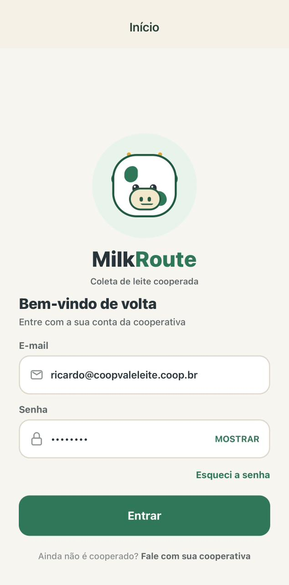

# Agro Manager Startup

App mobile (Expo + React Native) para coleta de leite em cooperativas.
Stack mínima: **React Native + expo-sqlite**. Veja [`AGENTS.md`](./AGENTS.md) e
[`rules/`](./rules) para as convenções do projeto.

## Rodar o projeto

```bash
npm install
npm start
```

## Estrutura atual

- `App.tsx`: boot (fontes + migração do banco SQLite + `RootNavigator`)
- `src/global/`: camada compartilhada (theme, ui, database, @types, routes)
- `src/modules/<feature>/`: um módulo por feature (`producer`, `auth`, `admin`, `milkman`),
  cada um com as pastas `assets, @types, database, global, pages, routes, service`
- `assets/`: imagens e arquivos estáticos
- `ref/`: mockups de design e o DRS (não é código do app)

## Telas




